# FIFA-2021-Data-Cleaning

## Introduction

Being a newbie in the data space and hearing some amazing people talk about how data cleaning takes a lot of time to clean and how challenging it could be.
The #datacleaningchallenge which was organized recently on the twitter space was about the messy and dirty FiFa 2021 csv data. This challenge was to encourage and gave everyone the opportunity to work on a data cleaning project with any prefered tools of their choice and also learn new skills and different ways while on the job.

## Problems and things to look out for
1. Incorrect data type
2. Errors in spelling and values
3. Wrong calculations accross rows and columns
4. Irrelevant data
5. Null entries and outliers

## About the data
The **FIFA21 csv data** is a dirty and messy data which was gotten from the public kaggle website that has 18979 rows and 77 columns and the colunm names include the following: ID, Name, LongName, photoUrl, playerUrl, Nationality, Positions, Age, OVA, POT, Team & Contract, Height, Weight, foot, BOV, BP, Growth, Joined, Loan Date End, Value, Wage, Release Clause, Attacking, Crossing, Finishing, Heading Accuracy, Short Passing, Volleys, Skill, Dribbling, Curve, FK Accuracy, Long Passing, Ball Control, Movement, Acceleration, Sprint Speed, Agility, Reactions, Balance, Power, Shot Power, Jumping, Stamina, Strength, Long Shots, Mentality, Aggression, Interceptions, Positioning, Vision, Penalties, Composure, Defending, Marking, Standing Tackle, Sliding Tackle, Goalkeeping, GKDiving, GK Handling, GK Kicking, W/F, SM, GK Positioning, GK Reflexes, Total Stats, Base Stats, A/W, D/W, IR, PAC, SHO, PAS, DRI, DEF, PHY, Hits. 

## Data Transformation

I will be using the Microsoft Power BI tool for this project. In order not to get confused, disconnected from the data cleaning process, i decided  to take the columns step by step and also document the process.

## Special Character

Using the power query editor and changing it to UTF-8 encoding, the application helped to remove majority of the strings and special characters from the data set

Before Character Encoding to UTF-8     |  After Character Encoding to UTF-8               
:-------------------------------------:|:------------------------------------:
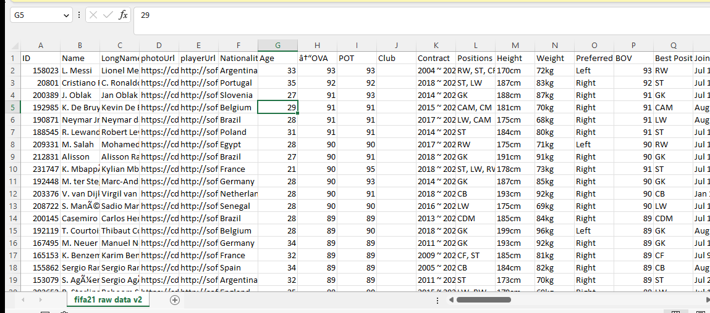                       |  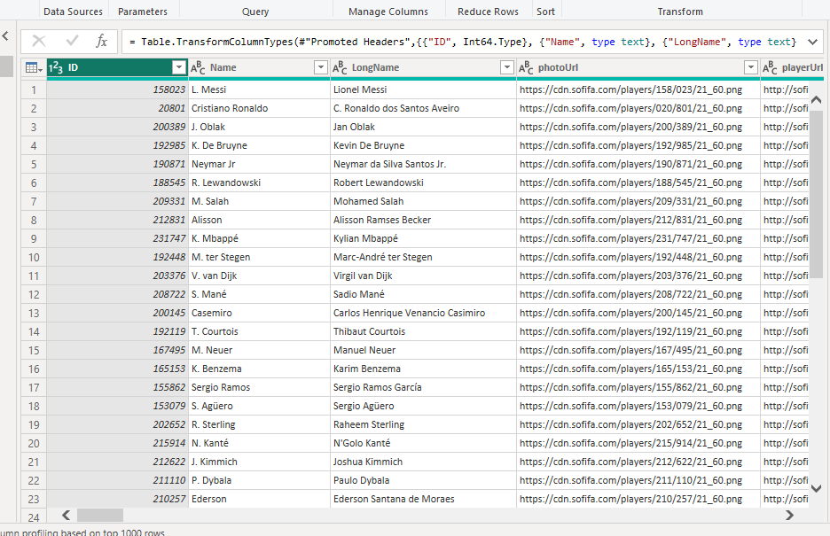

## Photourl and the Playerurl

The two columns which are photourl and playerurl are both metadata which means they are giving information about a another (ie.information about each players) data and they do not necessarily depend on the analysis to be carried out and so the columns were removed from the data.

Photo and Playerurl removed   | Photo and Playerurl after removing
:----------------------------:|:------------------------------------:
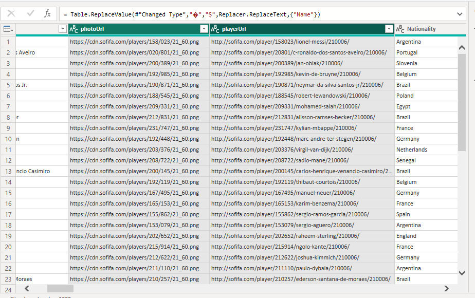 | 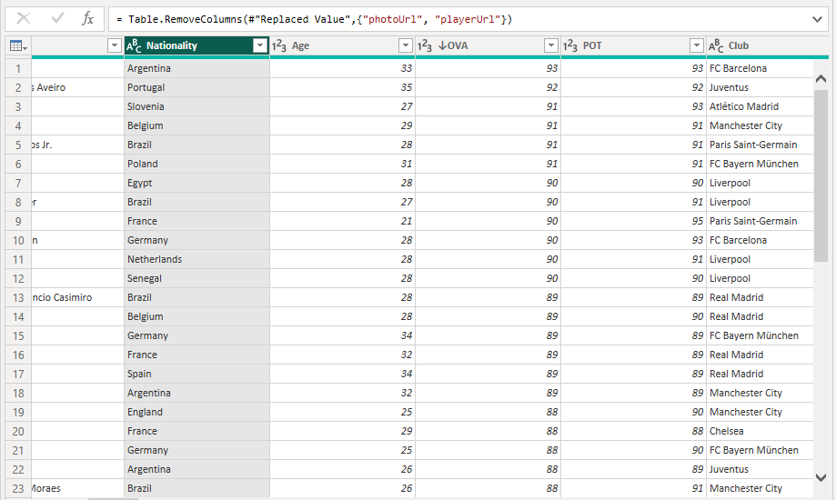

## The Contract Column

After a careful study of the contract column i took the decision to make and additional columns for the player contacts and they are as follows 
1.  A conditional column was created which was named **Agreement**. This will enable me know the players who are either on contract, on free or on loan.
2.  A split column by delimited was done on the contract column to have a sperate contract year. The end result was to get a sperate **Contract start year and Contract end year**.
3.  A custom column was created to get the **Contract duration column**. This will help to know how the number of years a player was with a particular club.
The **M language** was used in calclution of this column
The errors on the column were replaced with 0 and null as the case may be and the data type was changed

**_Note_**: This decision was taken to help me when i want to carry out my visualization

Contract before          |  Contract After
:-----------------------:|:-----------------------:
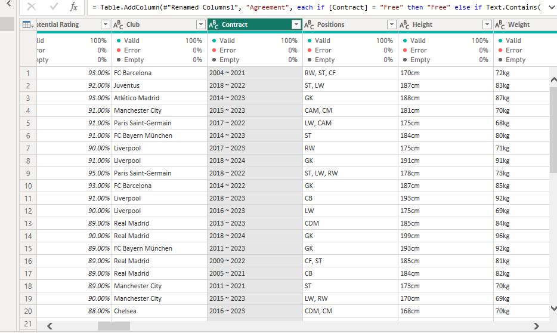  | 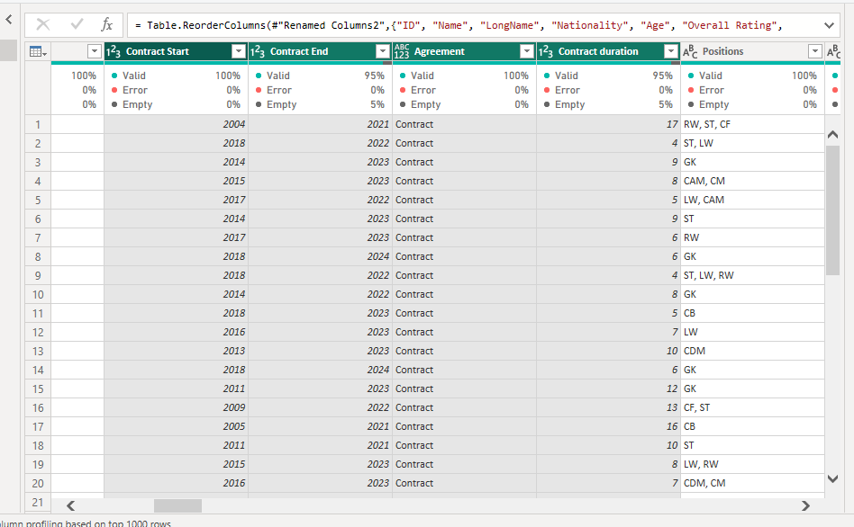

## The OVA, POT and the BOV Columns

A % column of each column was calculated by dividing by 100 to get the percentage of each column.The data type was changed and column renamed to Overall rating, Potential rating and Best overall ration. This was carried out as instructed in our data dictionary.

Overall Ratings Before   |  Overall Ratings After
:-----------------------:|:-------------------------:
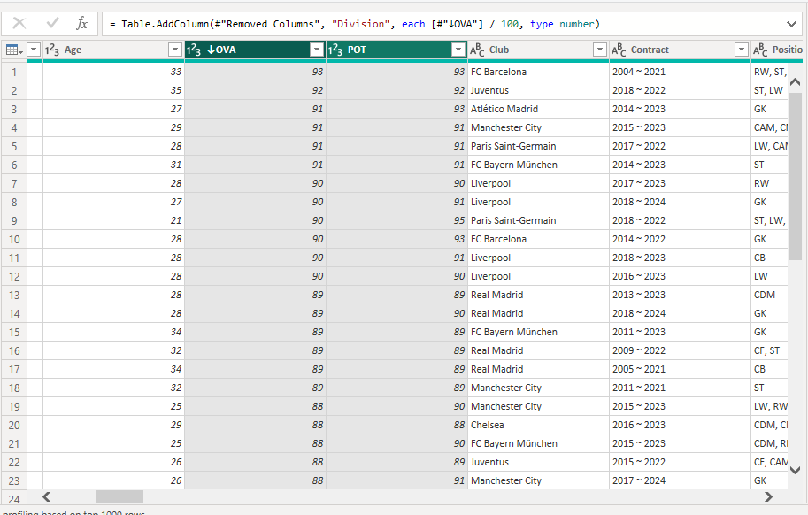    | 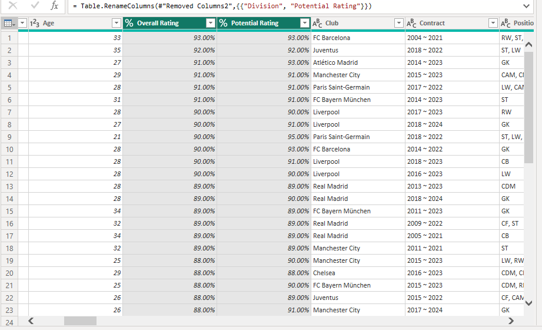    

## WF, SM and IR Columns

Replaced value was done in this column to remove the special character star and the data type was changed in these columns.

Before Removing       |   After Removing
:--------------------:|:-------------------:
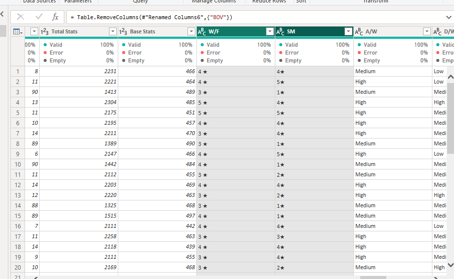   | 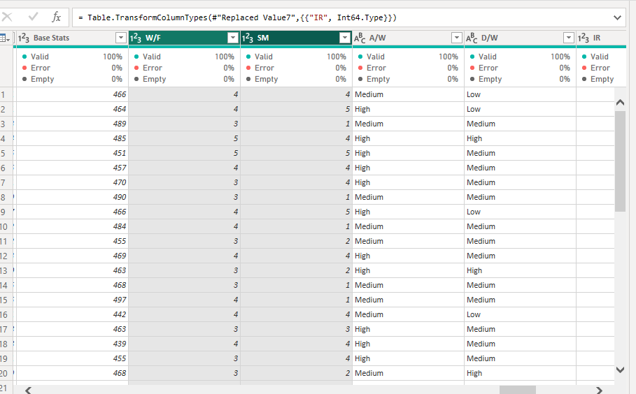

## Value, Wages and Release Clause Column

First a conditional column was created which if column name end with M and K then output is 1,000,000 and 1000 respectively. The characters where replaced with spece and the data type was changed. This are all done to enable easy calculations.

Before Conversion                      | After Conversion
:-------------------------------------:|:------------------:
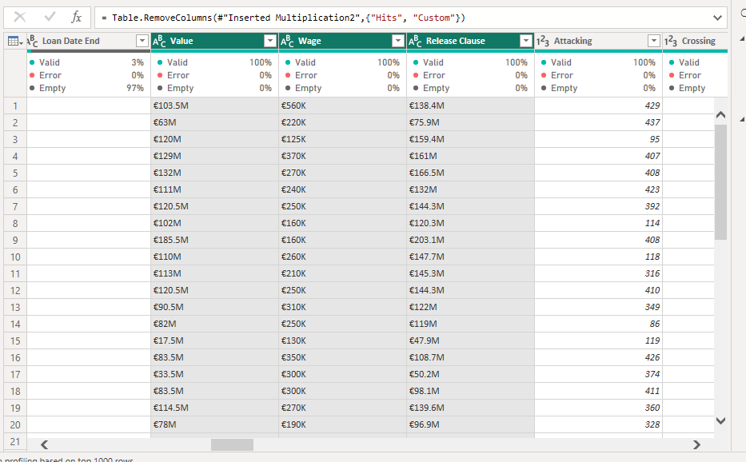 | 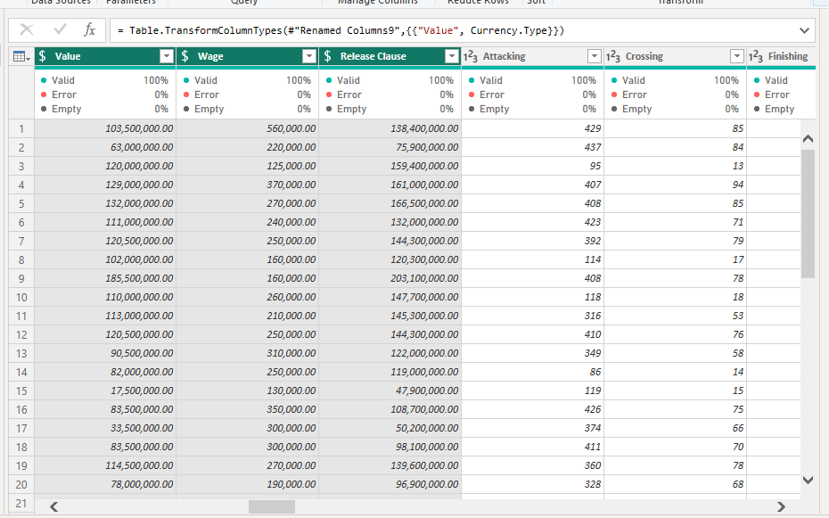

## Hits Column

The hit columns has the numbers of time a player profile was view and going by the data dictionary, the values that have K should be multiple by 1000. The data type was changed and the K value was replaced.
 
Before Conversion         |   After Conversion
:------------------------:|:-------------------:
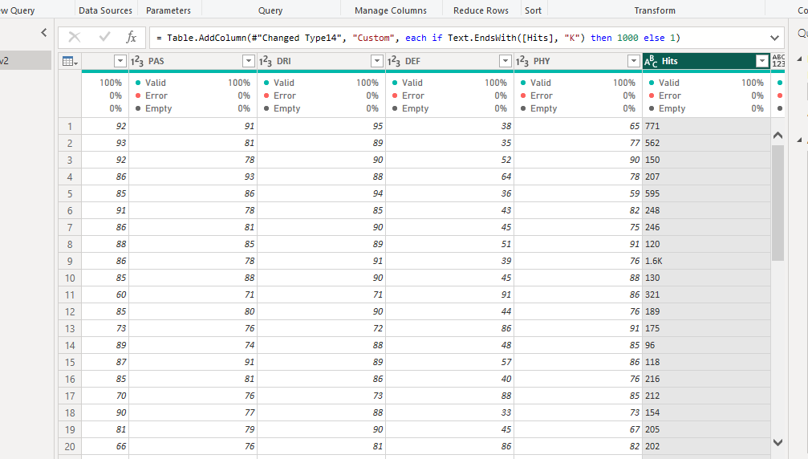       | 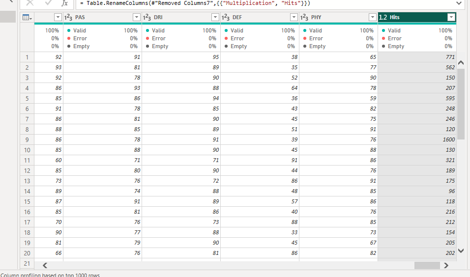

## Height and Weight

The height column values was changed from foot'inche to cm and the weight from kg to lbs. A conditional column was created, the standard calculation was used for the conversion of each column and made to stand alone to allow for easy calculation.

Height After         |   Weight After
:-------------------:|:---------------------:
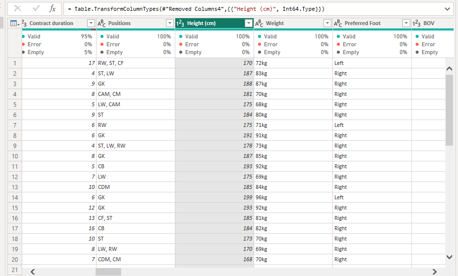 | 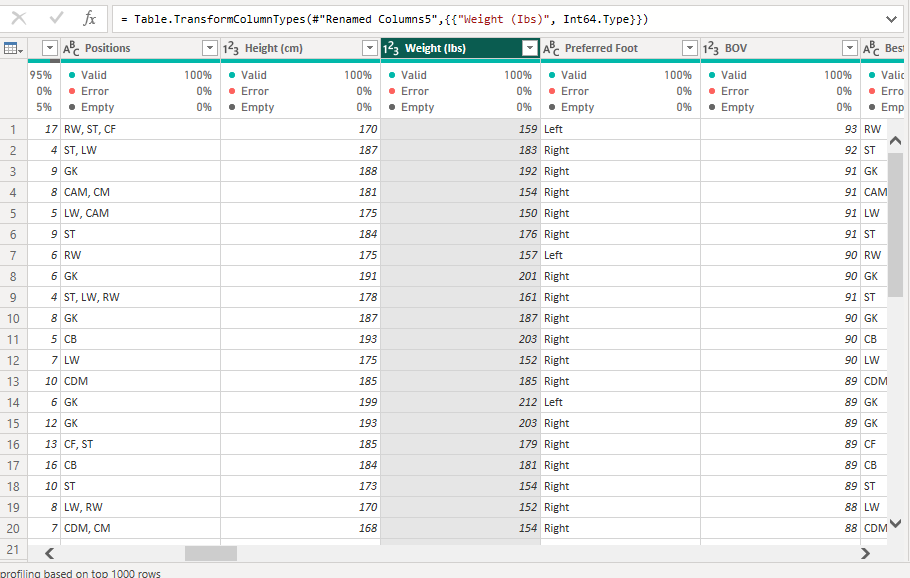

## Conclusion

Joining this challenge is a big one for me as it has helped me alot and i have also learn new skills during the challenge and how to document my projects the right way going forway. Thanks to the organisers for this great opportunity.

Thank You 
I'm open to suggestions and improvement.

